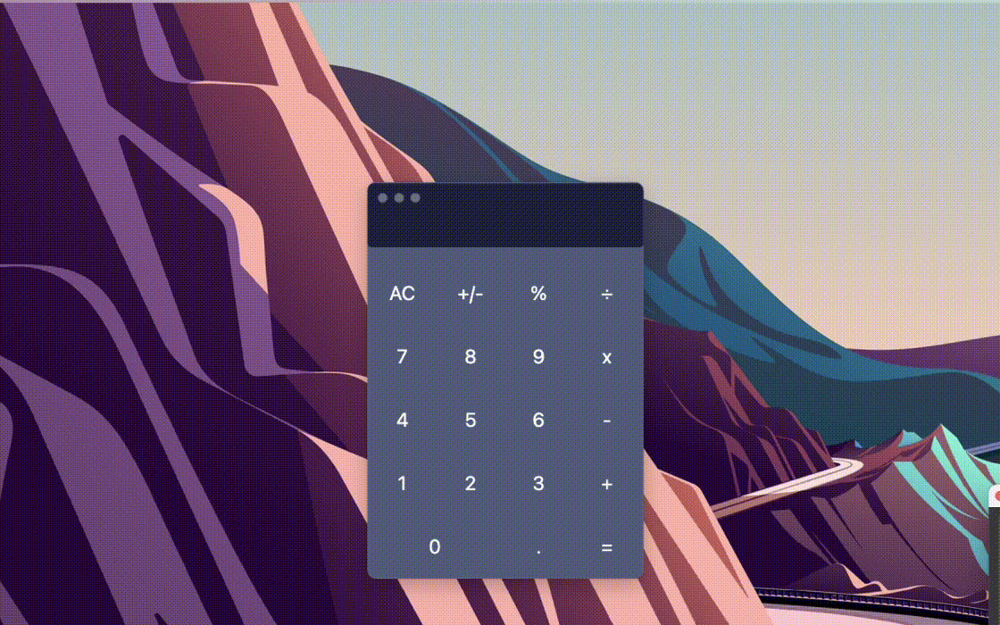

# Desktop Calculator

## Tech Used

- JavaScript
- Electron.js (JavaScript framework for creating desktop apps)
- HTML (for the "skeleton" of the app)
- CSS (for the styling)

## How it works

What electron does is it creates an instance of a Chromium window and then renders HTML and CSS in there. 
Native APIs allow to include some Windows/Linux/MacOS menus or bars that will make it look like a regular app.

All of the other functionality was copied over from my first app I've ever made: a calculator using HTML/CSS/JS, this is just a desktop adaptation
